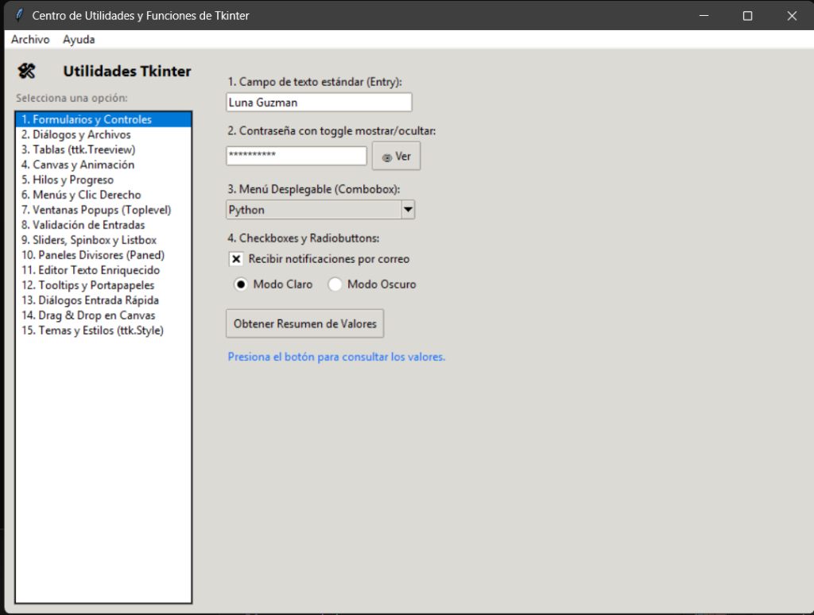
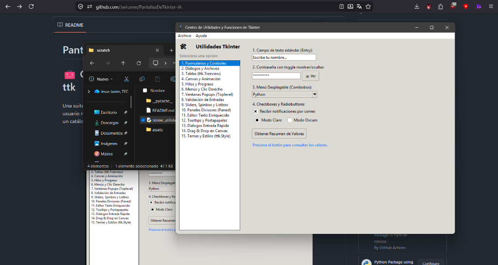
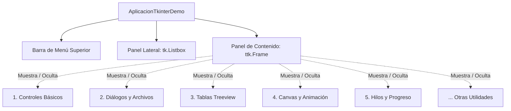

# PantallasDeTkinter-IA
# 🧰 Catálogo de Utilidades y Componentes con Tkinter y ttk

Una suite interactiva y modular en Python que reúne **15 utilidades prácticas y avanzadas** de la interfaz gráfica de usuario nativa de Python (**Tkinter** y **ttk**). Está diseñada tanto como panel de demostración en vivo (dashboard) como un catálogo de referencia para copiar y pegar componentes directamente en tus propios proyectos.

<p align="center">
  
  
</p>

---

## 📋 Tabla de Contenidos

- [Vista Previa](#-vista-previa)
- [Características Principales](#-características-principales)
- [Requisitos](#-requisitos)
- [Instalación y Ejecución](#-instalación-y-ejecución)
- [Arquitectura del Proyecto](#-arquitectura-del-proyecto)
- [Catálogo de las 15 Utilidades](#-catálogo-de-las-15-utilidades)
- [Cómo Reutilizar los Módulos en tus Proyectos](#-cómo-reutilizar-los-módulos-en-tus-proyectos)
- [Estructura del Código](#-estructura-del-código)

---

## ✨ Características Principales

- **Sin dependencias externas**: Construido 100% sobre la biblioteca estándar de Python (`tkinter`, `ttk`, `threading`, etc.).
- **Diseño 100% Modular**: Cada funcionalidad está encapsulada en una clase independiente derivada de `ttk.Frame`, lista para ser reutilizada en cualquier contenedor o ventana.
- **Navegación tipo Dashboard**: Panel lateral interactivo para explorar y probar cada utilidad sin reiniciar la aplicación.
- **Multihilo (Threading)**: Demostración de tareas en segundo plano que evitan que la interfaz gráfica se congele (*Not Responding*).
- **Validaciones en caliente**: Restricción de entrada de datos a nivel de pulsación de teclas (`validate="key"`).
- **Interactividad Gráfica**: Animación 2D con bucle de tiempo (`after()`) y soporte completo de *Drag & Drop* sobre lienzos.

---

## ⚙️ Requisitos

- **Python 3.8+** (Tkinter viene incluido por defecto en los instaladores oficiales de Python para Windows y macOS).
- *(En distribuciones Linux tipo Debian/Ubuntu, si no está instalado, se puede añadir con `sudo apt-get install python3-tk`)*.

---

## 🚀 Instalación y Ejecución

No se requiere instalar ningún paquete vía `pip`.

1. Clona o descarga el archivo en tu equipo.
2. Abre tu terminal o consola en la carpeta correspondiente y ejecuta:

```bash
python tkinter_utilidades.py
```

---

## 🏗️ Arquitectura del Proyecto

El código está estructurado bajo un patrón de contenedores intercambiables:



---

## 📚 Catálogo de las 15 Utilidades

| # | Módulo / Clase | Descripción | Componentes Clave |
|---|---|---|---|
| **1** | `UtilidadControlesBasicos` | Formularios y controles fundamentales | `ttk.Entry`, `ttk.Combobox`, `ttk.Checkbutton`, `ttk.Radiobutton`, toggle ver/ocultar contraseña. |
| **2** | `UtilidadDialogos` | Diálogos nativos del sistema operativo | `messagebox` (info, advertencia, error, confirmación), `filedialog` (abrir, guardar, carpetas) y `colorchooser`. |
| **3** | `UtilidadTablaTreeview` | Vista tabular de datos con orden y acciones | `ttk.Treeview` con scrollbar vertical, selección reactiva de filas, inserción y eliminación dinámica. |
| **4** | `UtilidadCanvasAnimacion` | Gráficos vectoriales y animación en tiempo real | `tk.Canvas`, trazado de primitivas (líneas, flechas, elipses, texto) y animación de rebote usando `.after()`. |
| **5** | `UtilidadProgresoThreading` | Tareas pesadas sin congelar la ventana | `threading.Thread` en segundo plano, barras de progreso determinadas e indeterminadas (`ttk.Progressbar`). |
| **6** | `UtilidadMenusYAtajos` | Menús contextuales y atajos globales | `tk.Menu` emergente en clic derecho (`<Button-3>`), eventos del portapapeles (`<<Copy>>`, `<<Paste>>`) y enlace a teclas como `Ctrl+S`. |
| **7** | `UtilidadVentanasSecundarias` | Ventanas emergentes libres y modales | `tk.Toplevel`, gestión de ventanas modales con `grab_set()` y `transient()`. |
| **8** | `UtilidadValidacionCampos` | Validación de datos en tiempo real | Filtro para permitir solo enteros (`validate='key'`), límite estricto de longitud de texto y chequeo de regex para email. |
| **9** | `UtilidadDeslizadoresListas` | Sliders numéricos y manipulación de listas | `ttk.Scale` con `DoubleVar`, `ttk.Spinbox` y transferencia bidireccional entre dos `tk.Listbox`. |
| **10** | `UtilidadPanelesDivisores` | Layouts redimensionables interactivos | `ttk.PanedWindow` anidado horizontal y verticalmente con divisores móviles (estilo IDE). |
| **11** | `UtilidadTextoEnriquecido` | Editor con etiquetas y búsqueda | `tk.Text` con formateo mediante `tag_configure` (negrita, colores, resaltados) y motor de búsqueda con `search()`. |
| **12** | `UtilidadTooltipsYPortapapeles` | Tooltips flotantes y portapapeles | Clase reusable `Tooltip` (sin bordes con `overrideredirect`), lectura y escritura en portapapeles del SO (`clipboard_append`, `clipboard_get`). |
| **13** | `UtilidadDialogosEntrada` | Solicitud rápida de valores tipados | `simpledialog.askstring`, `simpledialog.askinteger` (con validación de rango) y `simpledialog.askfloat`. |
| **14** | `UtilidadCanvasDragDrop` | Arrastrar y soltar objetos gráficos | Manipulación interactiva con eventos de ratón (`<ButtonPress-1>`, `<B1-Motion>`, `<ButtonRelease-1>`), `.move()` y `tag_raise()`. |
| **15** | `UtilidadTemasYEstilos` | Personalización visual dinámica | Detección de temas del sistema con `ttk.Style.theme_names()` y cambio de tema global en tiempo de ejecución con `theme_use()`. |

---

## 💡 Cómo Reutilizar los Módulos en tus Proyectos

Cada componente hereda de `ttk.Frame`, lo que permite incrustarlo fácilmente en cualquier ventana principal o ventana secundaria:

```python
import tkinter as tk
from tkinter_utilidades import UtilidadTablaTreeview

# 1. Crear ventana principal
root = tk.Tk()
root.title("Mi Propia Aplicación")
root.geometry("600x400")

# 2. Instanciar la utilidad deseada pasando la ventana contenedora
tabla = UtilidadTablaTreeview(root)
tabla.pack(fill="both", expand=True)

# 3. Iniciar el loop
root.mainloop()
```

---

## 📁 Estructura del Código

El archivo principal [`tkinter_utilidades.py`](file:///c:/Users/javie/.gemini/antigravity-ide/scratch/tkinter_utilidades.py) se organiza de la siguiente manera:

1. **Secciones 1 a 15**: Definición de cada clase de utilidad modular (`Utilidad*` y clase auxiliar `Tooltip`).
2. **Aplicación Demo (`AplicacionTkinterDemo`)**:
   - Inicialización de ventana principal y temas.
   - Creación del panel lateral con navegación por `Listbox`.
   - Contenedor derecho que conmuta de forma limpia los componentes usando `.pack_forget()` y `.pack()`.
   - Menú de opciones de sistema superior.
3. **Punto de Entrada (`__main__`)**: Arranque del ciclo de eventos `root.mainloop()`.
